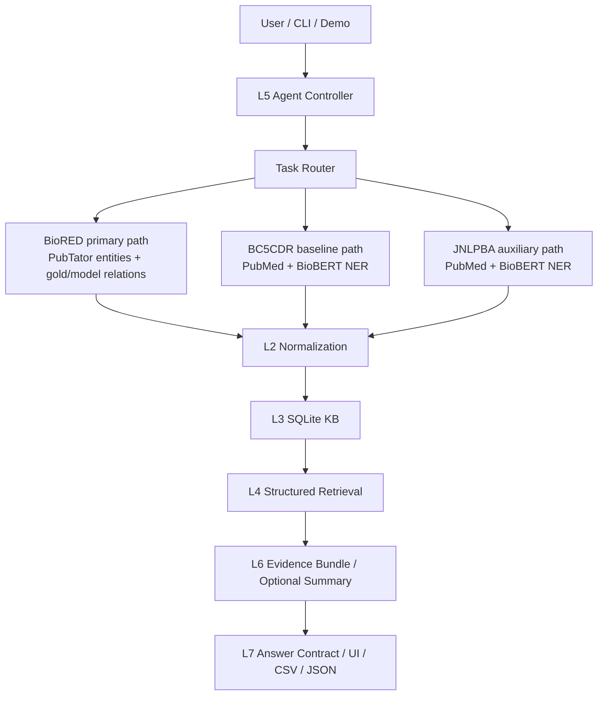

# Biomedical Literature Intelligence System Design

This is the current project-level system design. The older single-task
BioBERT NER framing has been superseded by a layered biomedical evidence
platform.

Canonical detailed docs:

- `doc/system_design_v2.md`: full layered design and progress tracker
- `doc/end_to_end_data_flow.md`: current data movement through L0-L7
- `doc/system_architecture_diagram.md`: quick visual map

## 1. Current Objective

Build a reproducible biomedical literature intelligence system that converts
PubMed abstracts and local biomedical corpora into structured, citation-grounded
evidence.

Primary task:

- `BioRED`: gene/protein-disease relation evidence

Retained supporting tasks:

- `BC5CDR`: chemical-disease evidence baseline
- `JNLPBA`: broader biomedical entity-discovery auxiliary path

Core constraints:

- Every evidence record must trace back to a PMID and source sentence when
  available.
- LLM output is constrained summarization over retrieved evidence, not a source
  of biomedical facts.
- Structured JSON/table outputs are first-class artifacts.

## 2. Logical Architecture



## 3. Implemented Layers

| Layer | Current status | Main files |
| --- | --- | --- |
| L0 PubMed ingestion | Implemented for PubMed-backed task paths | `src/ingestion/pubmed_client.py` |
| L1 extraction | Implemented as task-specific wrappers; BioRED supports local PubTator gold relations and 4A model-predicted relations over PubTator entities | `src/extraction/*_pipeline.py`, `src/extraction/biored_loader.py`, `src/extraction/biored_relation_infer.py`, `src/extraction/ner_infer.py` |
| L2 normalization | Implemented rule-based alias lookup over local HGNC/MeSH/ChEBI snapshots | `src/normalization/rule_based.py` |
| L3 KB | Implemented SQLite schema for papers, mentions, normalized entities, evidence sentences, BioRED relations, and relation provenance | `src/kb/schema.py`, `src/kb/writer.py` |
| L4 retrieval | Implemented mention, sentence-evidence, and relation retrieval modes | `src/retrieval/sqlite_service.py`, `src/kb/query.py` |
| L5 agent | Implemented deterministic read/refresh controller | `src/agent/controller.py` |
| L6 LLM | Partial: evidence bundle and `none`/Ollama path; hosted BYO providers are intentionally not wired yet | `src/llm/evidence_bundle.py`, `src/llm/router.py` |
| L7 output | Partial but implemented as a stable answer wrapper | `src/output/l7_answer.py`, `pipelines/run_l7_answer.py` |

BioRED mode boundary:

- `relation_mode=gold`: load curated relation rows from local BioRED PubTator.
- `relation_mode=model`: use local BioRED PubTator entities, enumerate gene-disease candidate pairs, and classify them with the trained relation model.
- New PubMed abstracts still need a BioRED-compatible entity extraction path before fully live gene-disease relation inference is possible.

## 4. Current Data Contracts

Two-table entity extraction paths:

```text
papers_df + entities_df
```

Used by:

- `BC5CDR`
- `JNLPBA`

Three-table relation extraction path:

```text
papers_df + entities_df + relations_df
```

Used by:

- `BioRED`

SQLite persistence writes:

- `papers`
- `entity_mentions`
- `normalized_entities`
- `evidence_sentences`
- `evidence_sentence_mentions`
- `entity_relations`
- `relation_provenance`

## 5. Query Modes

The L4/L5 retrieval contract currently supports:

- `pmid`
- `normalized_id`
- `type_keyword`
- `evidence_pmid`
- `evidence_normalized_id`
- `relation_pmid`
- `relation_entity_pair`

For BioRED relation evidence, the primary mode is:

```bash
python -m pipelines.run_agent_query \
  --task biored \
  --mode relation_entity_pair \
  --entity1_normalized_id 672 \
  --entity2_normalized_id D001943 \
  --db_path data/processed/kb/biomed_kb.db
```

## 6. Current Engineering Gaps

The remaining work is no longer "make BioBERT NER train once." The real gaps
are platform hardening:

1. Improve BioRED relation provenance quality, especially sentence selection and
   char-offset links.
2. Add migration/version tracking for SQLite schema and normalization snapshots.
3. Add pagination/ranking for larger retrieval result sets.
4. Wire provider-specific L6 clients only when needed, with citation
   post-validation.
5. Harden L7/API output contracts beyond the current CLI/demo wrapper.

## 7. Useful Entry Points

```bash
python -m pipelines.run_extract_biored --smoke
python -m pipelines.run_extract_biored --data_path data/raw/biored/BioRED/Test.PubTator --max_docs 5 --relation_mode model
python -m pipelines.run_ingest_to_sqlite --task biored --smoke
python -m pipelines.run_agent_query --task biored --mode relation_pmid --pmid SMOKE-BIORED-001 --allow_refresh --smoke --query "BRCA1 breast cancer"
python -m pipelines.run_l6_summary --provider none --task biored --mode relation_entity_pair --entity1_normalized_id 672 --entity2_normalized_id D001943 --question "What is the evidence?"
python -m pipelines.run_l7_answer --provider none --task biored --mode relation_entity_pair --entity1_normalized_id 672 --entity2_normalized_id D001943 --question "What is the evidence?"
```
