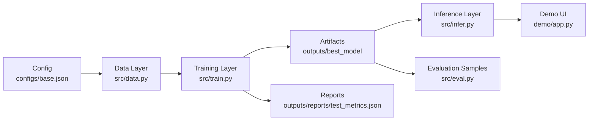

# BioBERT Biomarker NER System Design

## 1. Goals and Scope

This project fine-tunes a BioBERT-based NER model to extract biomarker-relevant biomedical entities (for example, chemicals and diseases) from literature-like text.

Current system scope:
- Inputs: BigBio datasets (currently focused on `bc5cdr`) or user-provided tokenized text.
- Outputs: token-level entity predictions, evaluation metrics, trained model weights, and tokenizer artifacts.
- Out of scope: production API service, online retrieval/database integration, active-learning loop, and monitoring/alerting.

## 2. Logical Architecture

## 3. Module Responsibilities

### 3.1 Configuration Layer
- File: `configs/base.json`
- Responsibility: controls model name, dataset, max length, learning rate, epochs, batch sizes, and train/eval/save strategy.
- Why it matters: keeps experiments configurable instead of hardcoding training behavior.

### 3.2 Data Layer
- File: `src/data.py`
- Responsibility:
  - loads raw datasets from Hugging Face BigBio,
  - converts entity annotations into token-level BIO tags,
  - aligns labels to tokenizer subwords (with `-100` for special tokens).
- Output: tokenized `DatasetDict` ready for Hugging Face `Trainer`.

### 3.3 Training Layer
- File: `src/train.py`
- Responsibility:
  - reads config and sets random seeds,
  - initializes `AutoTokenizer` and `AutoModelForTokenClassification`,
  - trains/evaluates with Hugging Face `Trainer`,
  - computes entity-level `precision/recall/f1` via `seqeval`,
  - saves best model and final test metrics.
- Main artifacts:
  - `outputs/best_model/*`
  - `outputs/reports/test_metrics.json`

### 3.4 Inference Layer
- File: `src/infer.py`
- Responsibility: loads a trained checkpoint and predicts token-level labels for input tokens.
- Current status: scaffold is in place, but outputs are still label IDs rather than fully mapped label strings/entities.

### 3.5 Evaluation and Analysis Layer
- File: `src/eval.py`
- Responsibility: collects sample predictions from the test split for qualitative error analysis.
- Current status: useful for quick inspection, but default dataset settings are inconsistent with current data config.

### 3.6 Demo Layer
- File: `demo/app.py`
- Responsibility: Streamlit UI for interactive prediction demo.
- Current status: good for basic workflow demo; not yet production-grade in input validation or result visualization.

## 4. Key Data Flows

### 4.1 Training Flow
1. Read `configs/base.json`.
2. Load `bc5cdr` and convert to `tokens + ner_tags`.
3. Tokenize and align labels into `input_ids/attention_mask/labels`.
4. Train and validate through `Trainer`.
5. Save best checkpoint to `outputs/best_model`.
6. Evaluate on test split and write metrics to `outputs/reports/test_metrics.json`.

### 4.2 Inference Flow
1. Load tokenizer and model from `outputs/best_model`.
2. Encode user-provided token sequence.
3. Run forward pass to get per-token label IDs.
4. Map IDs to readable labels and aggregate entity spans (target behavior).

## 5. Repository and Artifact Layout

- `configs/`: experiment configuration.
- `src/`: core logic (data, training, inference, evaluation, utilities).
- `outputs/checkpoints/`: intermediate training checkpoints.
- `outputs/best_model/`: deployable best-model snapshot.
- `outputs/reports/`: evaluation outputs and analysis files.
- `demo/`: minimal interactive demo app.

## 6. Current Progress Assessment

Current state is **“MVP training loop completed”**:
- Completed: data loading, training, evaluation, and model artifact export.
- Available metric: `eval_f1 ≈ 0.816` (from `outputs/reports/test_metrics.json`).
- Pending: readable inference outputs, demo default-path consistency, and more structured error analysis/testing.

## 7. Recommended Next Steps (Priority Order)

1. Standardize label mapping
- Persist `label2id/id2label` in model config during training, and return label names directly in inference.

2. Close the demo loop
- Change demo default model path to `outputs/best_model`, add input validation, and optionally highlight entity spans.

3. Normalize evaluation workflow
- Align `eval.py` defaults with current dataset config and add per-entity-class breakdown in reports.

4. Improve reproducibility
- Add one-command entry points (train/eval/infer) and minimal tests to validate end-to-end reruns.

## 8. Simple Mental Model

You can understand this project as four layers:
- Data preparation: `src/data.py`
- Model training: `src/train.py`
- Model consumption (inference): `src/infer.py`
- Demo and analysis: `demo/app.py` + `src/eval.py`

The core training pipeline is already working. The next engineering focus is to harden inference outputs and the demo/evaluation experience.
