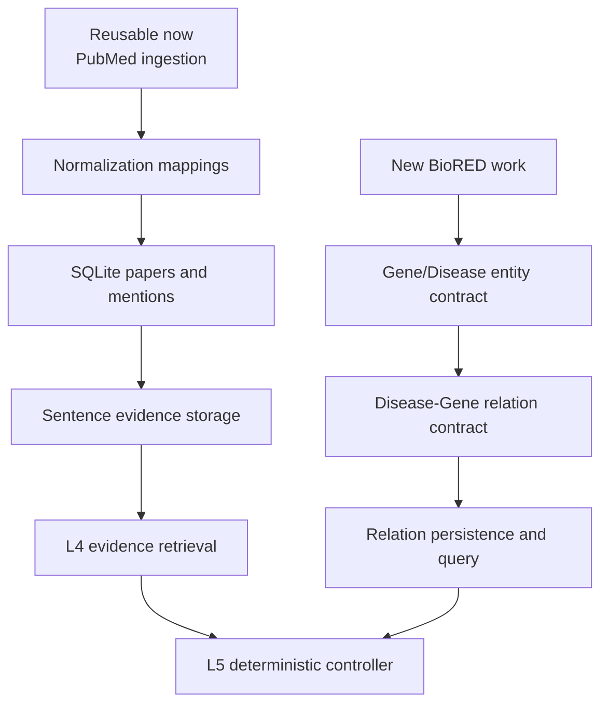

# BioRED Primary Task Transition

## Decision

The project primary evidence task is now defined as:

```text
BioRED -> gene/protein-disease relation evidence
```

The two previously implemented datasets remain useful but no longer represent
the primary research question:

| Dataset | Retained role | Reason |
| --- | --- | --- |
| `BC5CDR` | Chemical-disease evidence baseline | It annotates chemicals and diseases, not genes |
| `JNLPBA` | Molecular entity-discovery auxiliary task | It annotates protein, DNA, RNA, cell type, and cell line, not disease relations |
| `BioRED` | Primary gene-disease evidence task | It includes gene/protein and disease entities plus disease-gene relations |

## Why the Transition Is Required

The target user question is structurally:

```text
gene -> disease -> supporting evidence -> PMID citation
```

BC5CDR cannot evaluate that question because its entity/relation label space
is chemical-disease. JNLPBA can detect molecular entities but does not provide
disease relation labels. BioRED aligns with both the entity types and the
relationship needed for the primary task.

## What Is Already Reusable

The transition does not discard the existing backend work:



## Critical Contract Change

BC5CDR and JNLPBA currently produce two tables:

```text
papers_df
entities_df
```

BioRED primary evidence needs a third table:

```text
relations_df
```

Initial BioRED relation columns:

| Column | Meaning |
| --- | --- |
| `pmid` | Source PubMed document |
| `relation_type` | Relation label, such as `Disease-Gene` |
| `entity1_text`, `entity1_type`, `entity1_normalized_id` | First linked entity |
| `entity2_text`, `entity2_type`, `entity2_normalized_id` | Second linked entity |
| `evidence_sentence` | Selected supporting sentence for app display |
| `relation_source` | Whether the relation is curated, predicted, or smoke-only |

Important annotation note:

- BioRED relations are annotated at the document level.
- A sentence shown to the user must be selected and linked as evidence by the
  application; it should not be described as an officially sentence-labeled
  BioRED relation unless the source annotation explicitly supports that.

## Current Implementation Status

Implemented now:

- `src/extraction/biored_pipeline.py` defines a deterministic smoke contract.
- `pipelines/run_extract_biored.py --smoke` demonstrates
  `papers_df + entities_df + relations_df`.
- `src/contracts/registry.py` includes `biored:v1`.
- Existing BC5CDR and JNLPBA code remains available.

Not yet implemented:

- BioRED dataset loading and train/evaluation workflow.
- A live BioRED entity/relation model.
- SQLite relation table and relation writer.
- L4/L5 relation-level retrieval modes.

## Next Implementation Sequence

1. Inspect the official BioRED data format and relation labels locally.
2. Add a BioRED loader that produces normalized entity and curated relation
   records from the dataset.
3. Add SQLite relation/provenance tables.
4. Add L4 query modes for gene-disease relation evidence.
5. Add L5 BioRED refresh only after relation storage is available.

## Sources

- BioRED paper: https://pubmed.ncbi.nlm.nih.gov/35849818/
- BioRED-BC8 corpus paper: https://pmc.ncbi.nlm.nih.gov/articles/PMC11315767/
