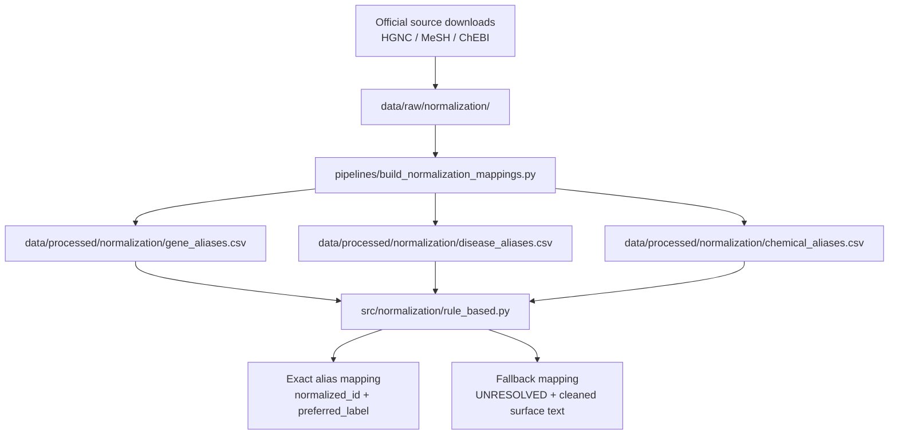
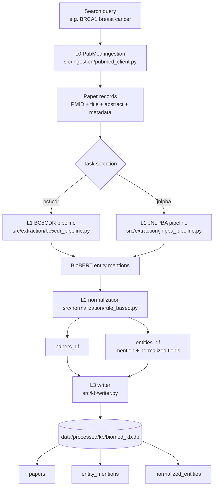
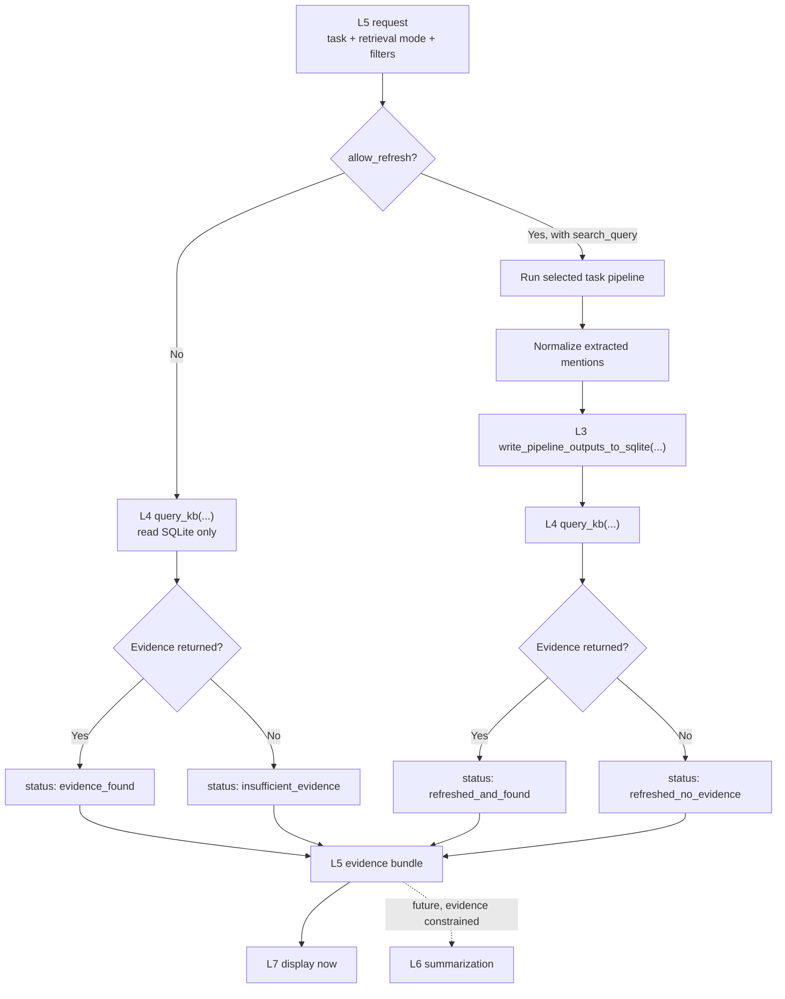
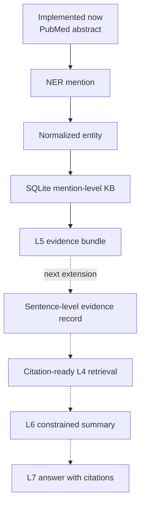

# End-to-End Data Flow

This document explains how data moves through the current biomedical
knowledge-base workflow. It is intended as the first reference to read when
returning to the project after a break.

## Scope

The current implemented path covers:

```text
external normalization sources
  -> local mapping CSVs
  -> PubMed abstract retrieval
  -> task-specific BioBERT NER
  -> deterministic normalization
  -> SQLite knowledge base
  -> L5 evidence bundle
```

Sentence-level citation evidence and LLM-generated summaries are planned
extensions, not current stored outputs.

## 1. Data Categories

These types of data serve different purposes and should not be confused with
each other.

| Data category | Example | Purpose | Location |
| --- | --- | --- | --- |
| Raw normalization source | HGNC complete set, MeSH XML, ChEBI TSV files | Official vocabulary input used to construct alias mappings | `data/raw/normalization/` |
| Processed mapping data | `gene_aliases.csv`, `disease_aliases.csv`, `chemical_aliases.csv` | Resolve extracted surface text to a canonical identifier and preferred label | `data/processed/normalization/` |
| Retrieved paper data | PMID, title, abstract from PubMed | Text input for extraction and source provenance for evidence | Runtime DataFrame, then SQLite `papers` |
| Extracted mention data | `BRCA1`, `breast cancer`, token offsets | Model output before/after normalization | Runtime DataFrame, then SQLite `entity_mentions` |
| Canonical entity data | `HGNC:1100`, `MESH:D001943` | Reusable normalized entity identities | SQLite `normalized_entities` |
| L5 controller response | `status`, `filters`, `evidence`, `refresh` | Structured output for UI or future L6 summarization | Returned JSON payload; not separately persisted |

## 2. Normalization Mapping Preparation

Normalization mapping preparation is a local data preparation step. It is
different from running PubMed extraction: these mappings are lookup resources
loaded by L2 during entity normalization.



### Mapping File Contents

| Source vocabulary | Processed file | Example alias | Example normalized ID | Example preferred label |
| --- | --- | --- | --- | --- |
| HGNC | `gene_aliases.csv` | `brca1` | `HGNC:1100` | `BRCA1` |
| MeSH | `disease_aliases.csv` | `breast cancer` | `MESH:D001943` | `Breast Neoplasms` |
| ChEBI | `chemical_aliases.csv` | Chemical alias from ChEBI names/synonyms | `CHEBI:<id>` | ChEBI preferred name |

### Persistence Boundary

| Stage | Input | Output | Stored locally? |
| --- | --- | --- | --- |
| Download raw vocabulary | Official upstream files | HGNC / MeSH / ChEBI raw files | Yes, under `data/raw/normalization/` |
| Build mappings | Raw vocabulary files | Three alias CSVs | Yes, under `data/processed/normalization/` |
| Normalize one mention | Entity type and extracted text | Normalized text, ID, source, score | Stored only when pipeline output is written to SQLite |

## 3. Extraction, Normalization, and SQLite Ingestion

This is the data-production path used when a new PubMed search is run and the
results are written into the knowledge base.



### Current Pipeline Tables

| Stage | Input | Current output fields | Persisted? |
| --- | --- | --- | --- |
| PubMed ingestion | Query string and filters | `pmid`, `title`, `year`, `journal`, `abstract` | Written later through `papers_df` |
| BioBERT NER | Abstract tokens and selected task model | `entity_type`, `entity_text`, `token_start`, `token_end` | Written later through `entities_df` |
| Normalization | Each extracted mention | `normalized_text`, `normalized_id`, `normalized_source`, `normalized_score` | Written later through `entities_df` |
| SQLite writer | `papers_df`, `entities_df` | Rows in three KB tables | Yes |

### SQLite Storage Boundary

| SQLite table | What it stores | Example |
| --- | --- | --- |
| `papers` | PubMed source records | `SMOKE001`, title, abstract |
| `entity_mentions` | Mentions tied to a PMID, including normalization result | `BRCA1 -> HGNC:1100` in `SMOKE001` |
| `normalized_entities` | Distinct resolved canonical entities | `HGNC:1100`, `BRCA1`, `Gene` |

The current SQLite schema stores mention-level evidence. It does not yet store
the exact supporting sentence for later citation-grounded summarization.

## 4. L5 Query-Time Controller Flow

L5 exposes a stable evidence workflow. It can either query what is already in
SQLite or explicitly refresh the KB and then query it.



### L5 Input and Output

Read-only example input:

```python
{
    "task": "bc5cdr",
    "retrieval_mode": "normalized_id",
    "normalized_id": "HGNC:1100",
    "allow_refresh": False
}
```

Explicit-refresh example input:

```python
{
    "task": "bc5cdr",
    "retrieval_mode": "pmid",
    "pmid": "SMOKE001",
    "search_query": "BRCA1 breast cancer",
    "allow_refresh": True
}
```

Current response shape:

```python
{
    "status": "refreshed_and_found",
    "task": "bc5cdr",
    "retrieval_mode": "pmid",
    "filters": {"pmid": "SMOKE001"},
    "refreshed": True,
    "count": 2,
    "evidence": [
        {"entity_text": "BRCA1", "normalized_id": "HGNC:1100"},
        {"entity_text": "breast cancer", "normalized_id": "MESH:D001943"}
    ],
    "refresh": {
        "search_query": "BRCA1 breast cancer",
        "papers_added": 1,
        "mentions_added": 2,
        "normalized_entities_added": 2
    },
    "message": None
}
```

### Why Refresh Is Explicit in v1

An empty SQLite result does not prove that no biological evidence exists. It
may only mean that a query has not yet been ingested into the local KB.

For that reason, L5 v1 does not silently run PubMed retrieval when a lookup is
empty. The caller must authorize refresh using `allow_refresh=True` and
provide a `search_query`.

## 5. Current Implemented Flow Versus Planned Extension



| Capability | Implemented now | Planned next |
| --- | --- | --- |
| Entity extraction | Yes | Improve model/service packaging |
| Canonical normalization | Yes | Handle ambiguous aliases and mapping version snapshots |
| SQLite persistence | Yes, mention-level | Add sentence and ingestion provenance tables |
| L5 controller | Yes, deterministic read/refresh paths | Add validated multi-step plans and decision traces |
| Citation-ready evidence sentences | No | Required before grounded L6 summaries |
| LLM answer generation | Router skeleton only | Consume evidence bundle after citation data is available |

## 6. File Map

| Data-flow responsibility | File |
| --- | --- |
| Build local normalization lookup CSVs | `pipelines/build_normalization_mappings.py` |
| Retrieve PubMed records | `src/ingestion/pubmed_client.py` |
| Run BC5CDR task path | `src/extraction/bc5cdr_pipeline.py` |
| Run JNLPBA task path | `src/extraction/jnlpba_pipeline.py` |
| Normalize extracted mentions | `src/normalization/rule_based.py` |
| Create SQLite tables | `src/kb/schema.py` |
| Write pipeline outputs to SQLite | `src/kb/writer.py` |
| Query SQLite through a stable L4 contract | `src/retrieval/sqlite_service.py` |
| Orchestrate read-only or refresh evidence paths | `src/agent/controller.py` |
| Run L5 from the command line | `pipelines/run_agent_query.py` |

## 7. Useful Commands

Build normalization mappings after raw official files have been downloaded:

```bash
python -m pipelines.build_normalization_mappings
```

Run an L5 local smoke refresh and evidence query:

```bash
python -m pipelines.run_agent_query --task bc5cdr --mode pmid --pmid SMOKE001 --query "BRCA1 breast cancer" --allow_refresh --smoke
```

Query existing normalized evidence without modifying the KB:

```bash
python -m pipelines.run_agent_query --task bc5cdr --mode normalized_id --normalized_id HGNC:1100
```
