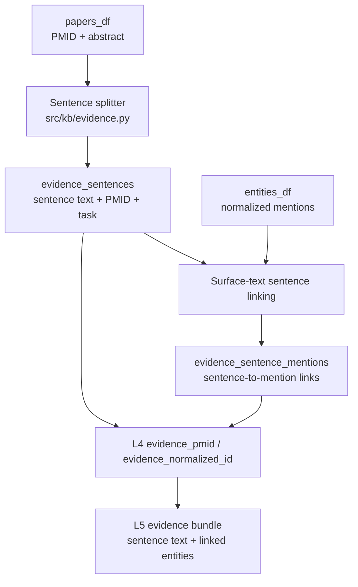

# Sentence-Level Evidence Upgrade (L3-L5 v1.1)

Obsoleted on: 2026-06-16 (America/Los_Angeles)

## Why This Upgrade Exists

The first complete backend flow stored normalized entity mentions:

```text
PMID -> entity mention -> normalized ID
```

That is sufficient for entity lookup, but not for a citation-grounded answer.
An answer layer needs the source sentence that supports a retrieved entity or
relationship.

This upgrade adds the evidence unit required before L6 summarization:

```text
PMID -> source sentence -> linked normalized mentions
```

This is labeled **L3-L5 v1.1**, not L5 v2. The controller remains
deterministic and still requires explicit refresh permission. Natural language
planning, coverage-aware refresh, and LLM summarization remain future work.

## Data Flow Change



## What Changed by Layer

| Layer | Before this upgrade | Added in this upgrade |
| --- | --- | --- |
| L3 SQLite KB | Stored papers, mentions, normalized entities | Stores sentence evidence and sentence-to-mention links |
| L4 Retrieval | Returned mention rows or PMID lists | Returns sentence evidence by PMID or normalized ID |
| L5 Controller | Returned L4 mention-level evidence | Can request citation-ready sentence evidence while keeping deterministic control |

## L3 Storage Additions

### `evidence_sentences`

| Column | Meaning |
| --- | --- |
| `evidence_id` | Primary key for one stored sentence |
| `pmid` | Source paper identifier |
| `task` | Pipeline that produced the evidence, such as `bc5cdr` or `jnlpba` |
| `sentence_index` | Sentence order within the abstract |
| `sentence_text` | Source sentence preserved for evidence display |
| `source` | Current source type: `pubmed_abstract` |

### `evidence_sentence_mentions`

| Column | Meaning |
| --- | --- |
| `evidence_id` | Linked sentence |
| `mention_id` | Linked normalized mention from `entity_mentions` |

The link table permits one sentence to contain multiple entities and one
mention to be retrieved together with its source sentence.

### Existing Database Upgrade Note

Creating the new tables does not backfill sentence evidence for rows ingested
before this upgrade. To populate sentence evidence in an existing local
database, re-run the relevant ingestion workflow after updating the code:

```bash
python -m pipelines.run_ingest_to_sqlite --task bc5cdr --smoke
python -m pipelines.run_ingest_to_sqlite --task jnlpba --smoke
```

For live PubMed data, re-run the live ingestion command for the query whose
sentences should be available for evidence retrieval.

## Sentence Splitting and Linking Policy

Version 1.1 uses deterministic rules:

1. Normalize repeated whitespace in each abstract.
2. Split after `.`, `!`, or `?` followed by whitespace.
3. Store each non-empty sentence in `evidence_sentences`.
4. Link a mention to a sentence when its extracted surface text occurs in
   that sentence, case-insensitively.

Why surface-text linking is used now:

- Current extraction output reliably includes mention text.
- Existing output does not yet provide exact source character offsets.
- Some smoke fixture token offsets are designed for pipeline validation, not
  exact sentence-location reconstruction.

Future precision upgrade:

- preserve exact character offsets during extraction
- link mentions to sentences by character span instead of surface matching
- replace the simple sentence splitter with a biomedical segmenter if
  abbreviation handling becomes important

## L4 Retrieval Additions

Two new modes are exposed through `src/retrieval/sqlite_service.py`:

| Mode | Input | Output |
| --- | --- | --- |
| `evidence_pmid` | `pmid`, optional `task` | Sentences from one paper with linked entities |
| `evidence_normalized_id` | `normalized_id`, optional `task` | Sentences that contain a linked normalized entity |

Existing modes remain unchanged:

```text
pmid
normalized_id
type_keyword
```

This preserves older mention-level queries while allowing downstream layers to
request richer evidence intentionally.

## L5 Evidence Bundle Addition

L5 can now use an evidence retrieval mode:

```python
{
    "task": "bc5cdr",
    "retrieval_mode": "evidence_pmid",
    "pmid": "SMOKE001",
    "search_query": "cisplatin kidney diseases",
    "allow_refresh": True
}
```

The returned `evidence` field contains sentence records:

```python
[
    {
        "pmid": "SMOKE001",
        "task": "bc5cdr",
        "sentence_text": "Cisplatin is associated with kidney diseases.",
        "entities": [
            {"entity_text": "Cisplatin", "normalized_id": "CHEBI:27899"},
            {"entity_text": "kidney diseases", "normalized_id": "MESH:D007674"}
        ]
    }
]
```

The refresh summary additionally records `evidence_sentences_added`.

## Files Changed in This Upgrade

| File | Role |
| --- | --- |
| `src/kb/evidence.py` | Deterministic sentence splitting and mention-to-sentence matching |
| `src/kb/schema.py` | Sentence evidence and link tables |
| `src/kb/writer.py` | Sentence persistence and mention linking |
| `src/kb/query.py` | Sentence-level SQL query functions |
| `src/retrieval/sqlite_service.py` | Stable evidence retrieval modes |
| `src/agent/controller.py` | Evidence modes and refresh sentence-count reporting |
| `tests/unit/test_kb_sqlite.py` | Storage/link regression coverage |
| `tests/unit/test_retrieval_sqlite_service.py` | L4 evidence contract coverage |
| `tests/unit/test_agent_controller.py` | L5 sentence evidence smoke coverage |

## Definition of Done

- Abstracts are split into persisted evidence sentences during SQLite ingest.
- Stored mentions are linked to sentences containing their source text.
- L4 retrieves sentence records by PMID and normalized ID.
- L5 returns sentence evidence through an explicit evidence retrieval mode.
- Existing mention-level query modes remain available.
- Unit and smoke tests validate the upgraded flow.
