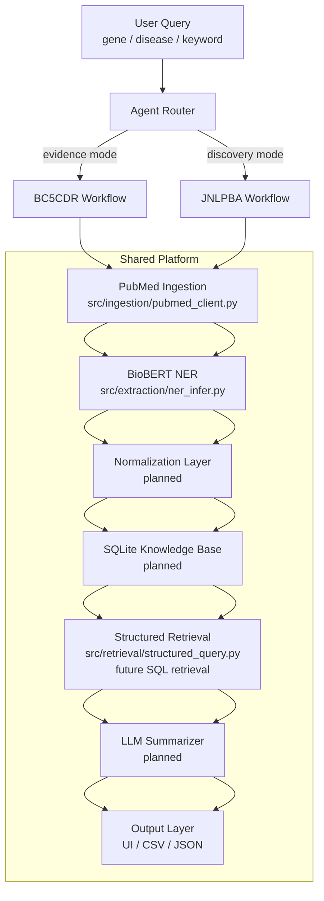
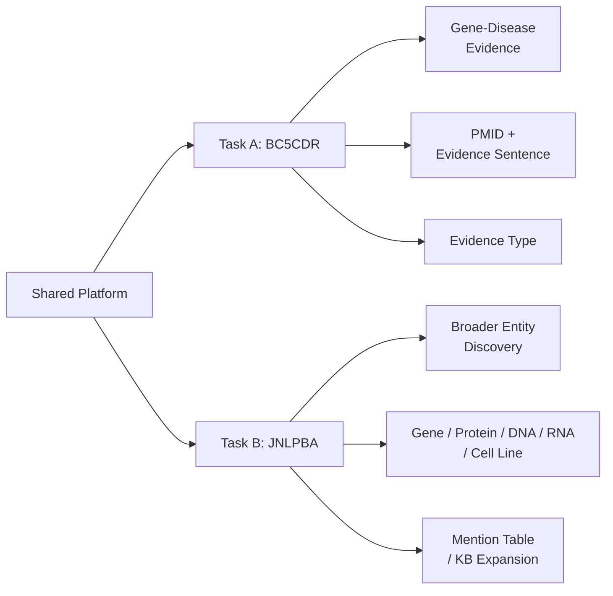

# System Architecture Diagram

This diagram is the quick orientation map for the platform.

## 1. Platform Overview

## 2. Task Split

## 3. How To Read It

- `BC5CDR` is the evidence task used for association analysis.
- `JNLPBA` is the discovery task used for broader biomedical entity extraction.
- Both tasks share ingestion, retrieval, and storage infrastructure.
- The difference is mainly the model, label space, and output schema.

## 4. Current Status

- `PubMed ingestion`: implemented
- `BioBERT NER`: implemented
- `BC5CDR workflow`: implemented
- `JNLPBA workflow`: scaffold only
- `Normalization / KB / Agent / LLM layers`: planned
