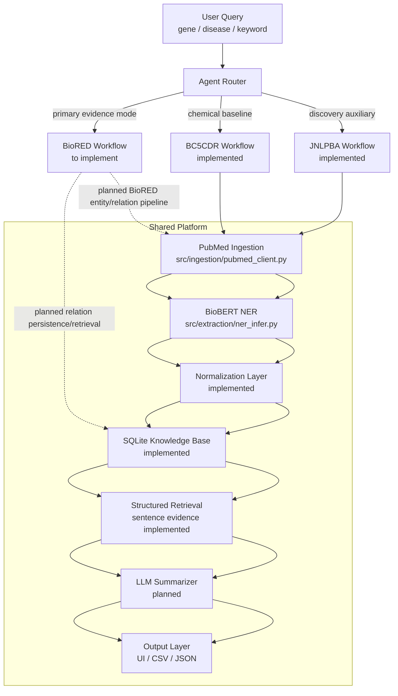
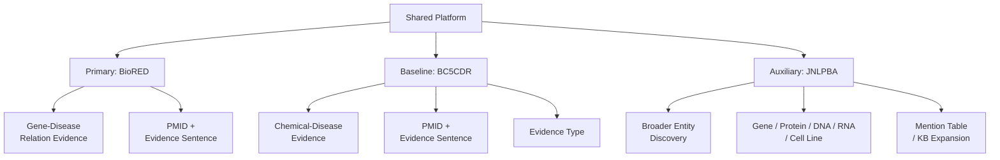

# System Architecture Diagram

This diagram is the quick orientation map for the platform.

## 1. Platform Overview

## 2. Task Split

## 3. How To Read It

- `BioRED` is the primary target because it contains gene/protein-disease relations.
- `BC5CDR` is a retained chemical-disease evidence baseline. It does not provide gene annotations.
- `JNLPBA` is a retained discovery task used for broader biomedical entity extraction.
- All task paths reuse ingestion, normalization, storage, and retrieval
  infrastructure where their data contracts overlap.
- The difference is mainly the model, label space, and output schema.

## 4. Current Status

- `PubMed ingestion`: implemented
- `BioBERT NER`: implemented
- `BC5CDR workflow`: implemented
- `JNLPBA workflow`: implemented baseline/smoke path
- `BioRED workflow`: smoke contract only; live loader/relation persistence not yet implemented
- `Normalization / KB / Agent layers`: implemented through sentence evidence
- `LLM layer`: provider skeleton only; grounded summarization remains planned
